**项目简介：**  
本项目基于主流的前后端分离架构，采用 **SpringBoot + Vue 技术栈**，配套 **MySQL 数据库**，适用于毕业设计与课题实训开发。  
本人已整理了超 **4000 多套毕业设计源码+论文+开题报告+PPT...**，涵盖 **Java、SpringBoot、Vue、SSM、uni-app 小程序、PHP、Android** 等方向，支持功能修改定制与论文服务。  
**团队提供以下服务：**  
- 项目代码修改与调试  
- 数据库配置与远程协助  
- 论文定制与修改  
**获取更多的4000多套源码或SQL文件请联系：**  
- QQ：3906443360 微信：BesheHelp

## springboot016房产销售系统

**项目简介：**  
本项目基于主流的前后端分离架构，采用 **SpringBoot + Vue 技术栈**，配套 **MySQL 数据库**，适用于毕业设计与课题实训开发。  
本人已整理了超 **4000 多套毕业设计源码+论文+开题报告+PPT...**，涵盖 **Java、SpringBoot、Vue、SSM、uni-app 小程序、PHP、Android** 等方向，支持功能修改定制与论文服务。  
**团队提供以下服务：**  
- 项目代码修改与调试  
- 数据库配置与远程协助  
- 论文定制与修改  
**获取更多的4000多套源码或SQL文件请联系：**  
- QQ：3906443360 微信：BesheHelp**

# 系统实现与系统测试

# 第五章 系统实现

5.1用户功能模块

用户点击进入到系统操作界面，可以对首页、个人中心、房源信息管理、交易订单管理、预约看房管理、评价管理、我的收藏管理等功能模块，个人信息：通过列表可以获取账号、姓名、性别、手机、邮箱、照片、备注并进行修改操作，如图5-1所示。

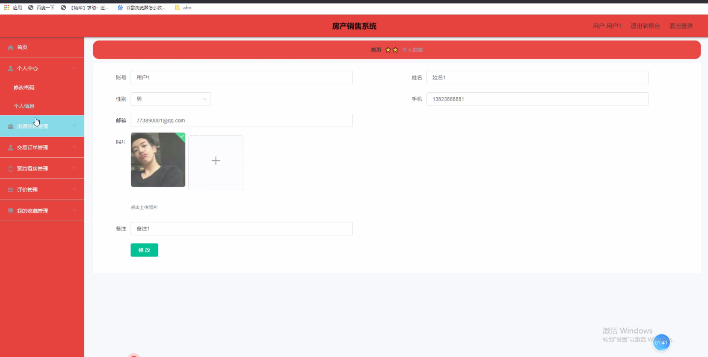

图5-1个人信息界面图

房源信息管理：通过列表可以获取房源名称、房源类型、房源户型、房源图片、所在区域、房源位置、房源面积、每米价格、总计、发布时间、销售账号、销售姓名、销售手机等信息，进行详情、购房、预约、查看评论等操作，如图5-2所示。

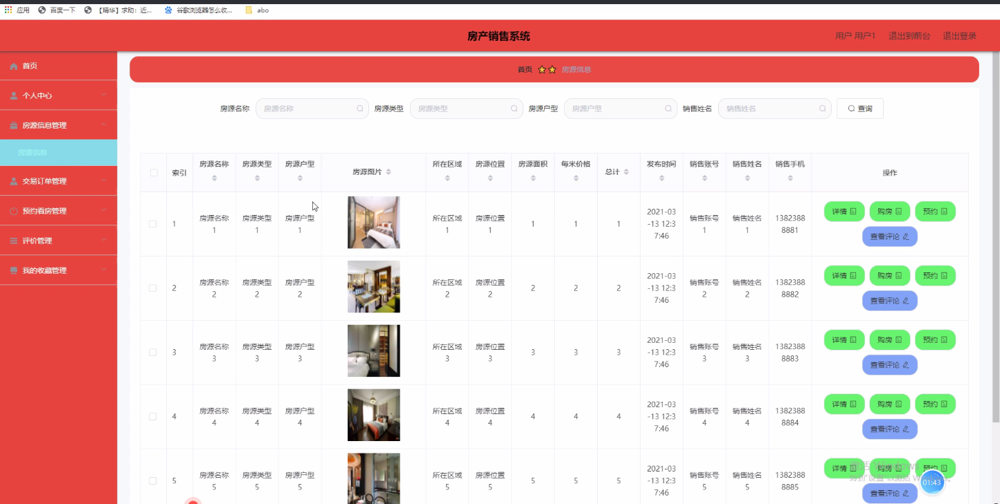

图5-2房源信息管理界面图

交易订单管理：通过列表可以获取账号、姓名、订单编号、房源名称、房源类型、房源户型、房源图片、总计、销售账号、销售姓名、交易时间、备注、是否支付等信息，进行详情、评价、删除等操作，如图5-3所示。

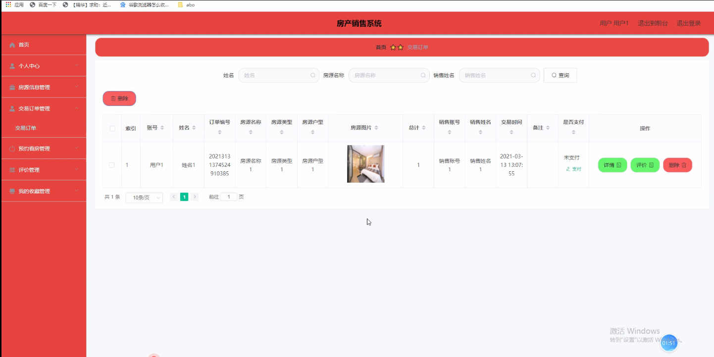

图5-3交易订单管理界面图

预约看房管理：通过列表可以获取账号、姓名、手机、房源名称、房源类型、房源户型、房源图片、预约时间、销售账号、销售姓名、销售手机、审核回复、审核状态等信息，进行详情、删除操作，如图5-4所示。

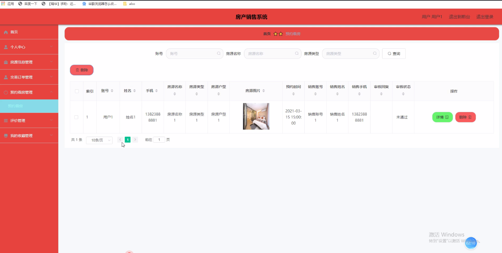

图5-4预约看房管理界面图

5.2管理员功能模块

管理员通过用户名和密码、角色填写完成后进行登录，如图5-5所示。管理员登录成功后进入到系统操作界面，可以对首页、个人中心、用户管理、销售经理管理、房源信息管理、房源类型管理、房子户型管理、交易订单管理、预约看房管理、评价管理、我的收藏管理、系统管理等功能模块进行相对应操作。

用户管理：通过列表可以获取账号、姓名、性别、手机、邮箱、照片、备注等内容，可以进行详情、修改或删除等操作，如图5-6所示。

图5-5管理员登录界面图

图5-6用户管理界面图

销售经理管理：通过列表可以获取销售账号、销售姓名、性别、头像、身份证、销售手机、年龄等信息，进行详情、删除或修改等操作，如图5-7所示。

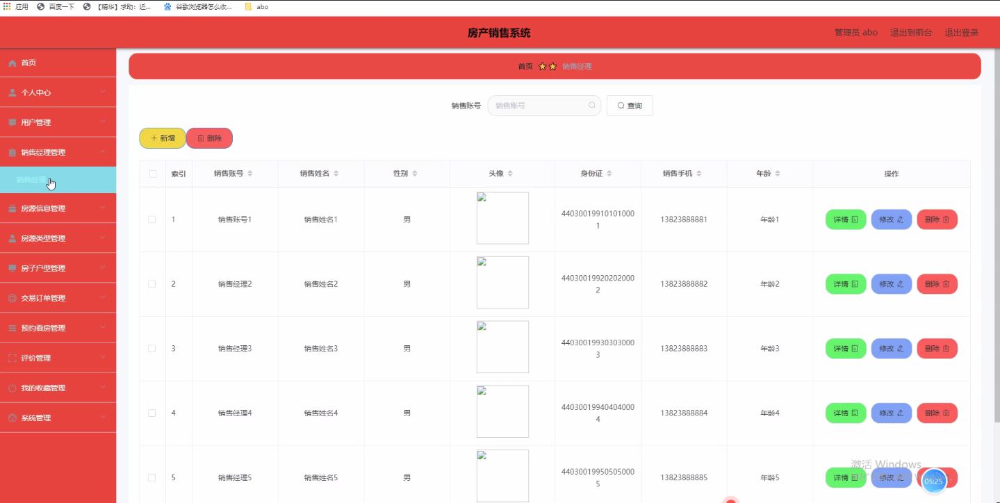

图5-7销售经理管理界面图

房源信息管理：通过列表可以获取房源名称、房源类型、房源户型、房源图片、所在区域、房源位置、房源面积、每米价格、总计、发布时间、销售账号、销售姓名、销售手机等信息，进行详情、修改、查看评论、删除等操作，如图5-8所示。

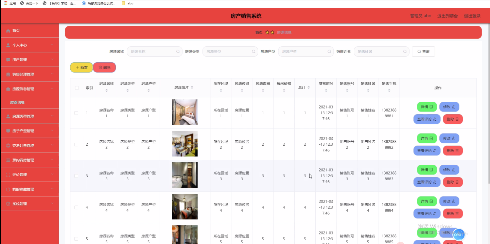

图5-8房源信息管理界面图

房源类型管理：通过列表可以获取房源类型等信息，进行修改或删除操作，如图5-9所示。

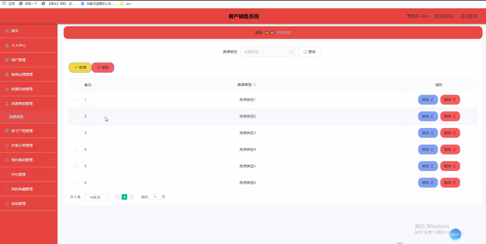

图5-9房源类型管理界面图

房子户型管理：通过列表可以获取房子户型等信息，进行修改或删除操作，如图5-10所示。

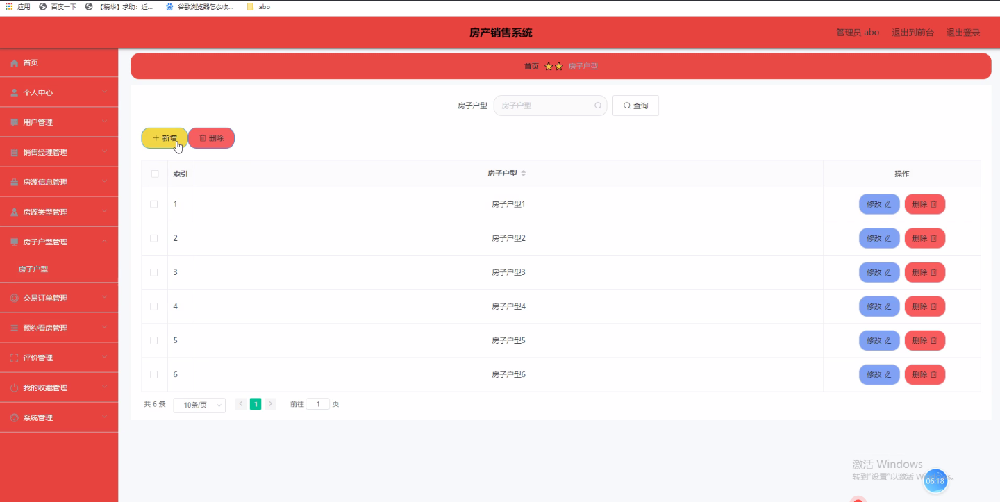

图5-10房子户型管理界面图

交易订单管理：通过列表可以获取账号、姓名、订单编号、房源名称、房源类型、房源户型、房源图片、总计、销售账号、销售姓名、交易时间、备注、是否支付等信息，进行详情、修改或删除操作，如图5-11所示。

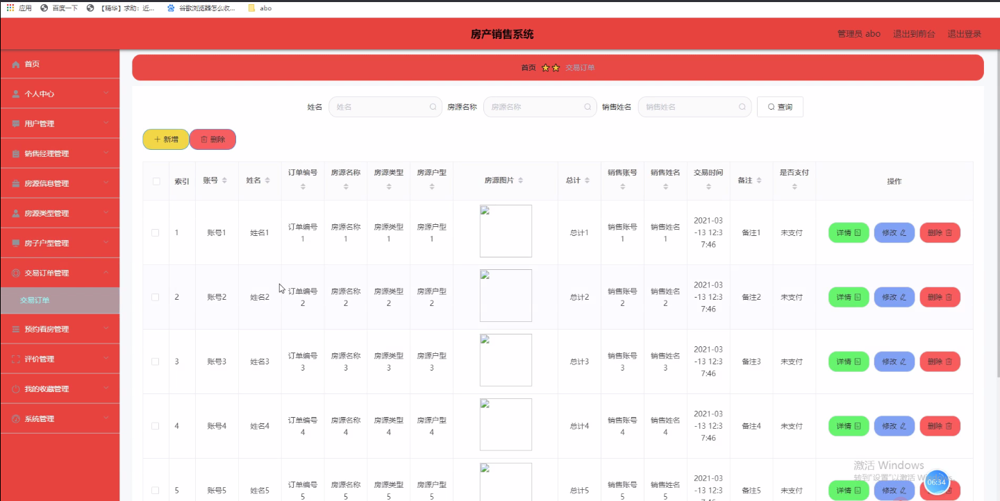

图5-11交易订单管理界面图

5.3销售经理功能模块

销售经理点击进入到系统操作界面，可以对首页、个人中心、房源信息管理、交易订单管理、预约看房管理、评价管理等功能模块，房源信息管理：通过列表可以获取房源名称、房源类型、房源户型、房源图片、所在区域、房源位置、房源面积、每米价格、总计、发布时间、销售账号、销售姓名、销售手机等信息并进行详情、修改、查看评论删除等操作，如图5-12所示。

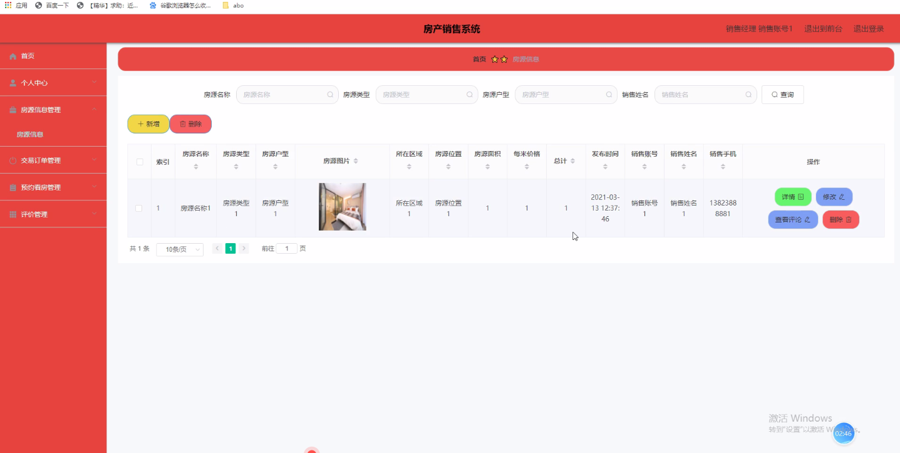

图5-12房源信息管理界面图

预约看房管理：通过列表可以获取账号、姓名、手机、房源名称、房源类型、房源户型、房源图片、预约时间、销售账号、销售姓名、销售手机、审核回复、审核状态等信息，进行详情、修改、删除操作，如图5-13所示。

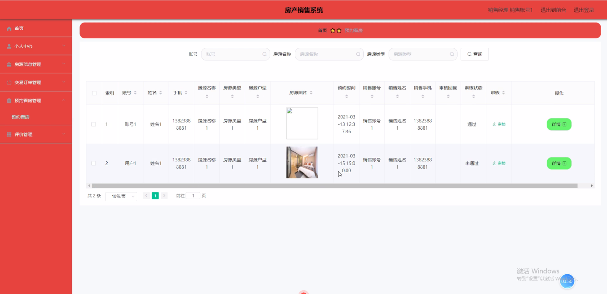

图5-13预约看房管理界面图

5.4前台首页功能模块

房产销售系统，在前台首页可以查看首页、房源信息、个人中心、后台管理等内容，如图5-14所示。

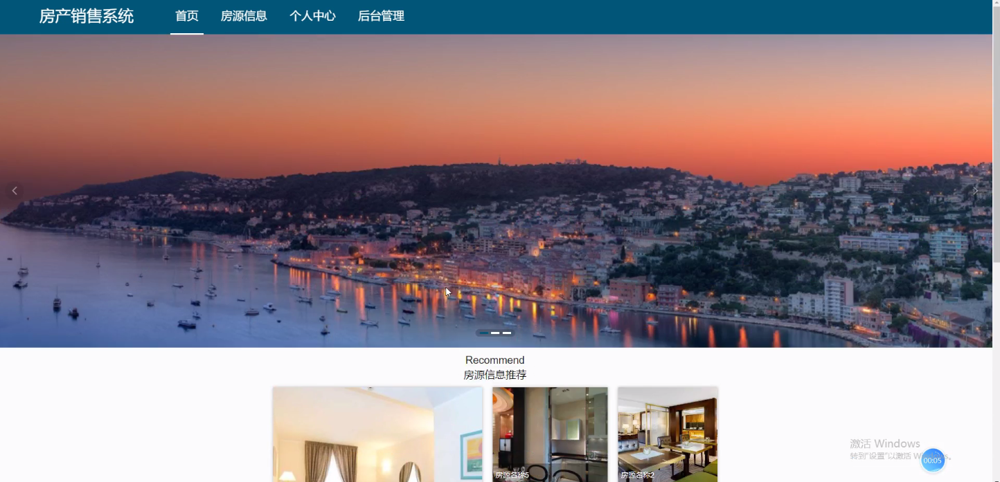

图5-14前台首页功能界面图

房源信息，在房源信息页面通过填写房源名称、房源类型、房源户型、房源图片、所在区域、房源位置、房源面积、每米价格、总计、发布时间、销售账号、销售姓名、销售手机等信息进行购房、预约及点我收藏等操作，如图5-15所示。

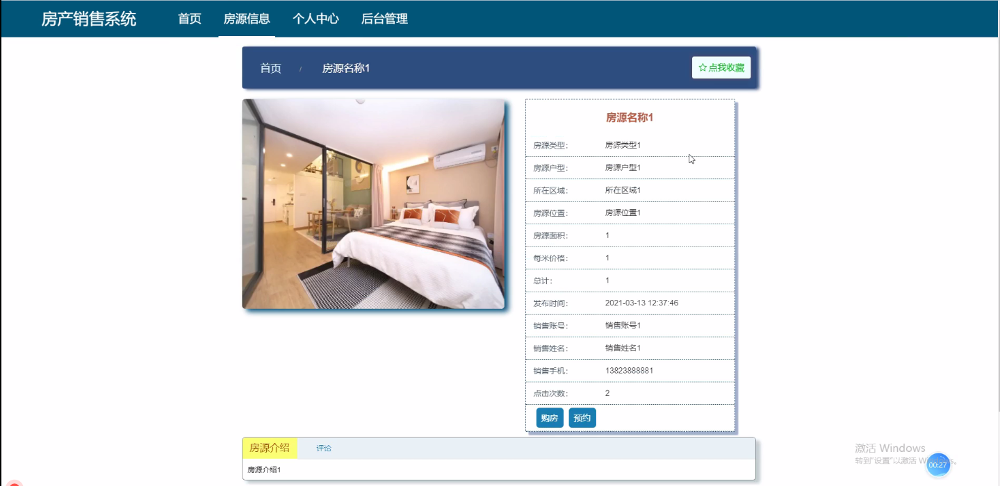

图5-15房源信息界面图

个人中心，在个人中心页面通过填写账号、密码、姓名、性别、手机、邮箱、照片、备注等信息进行更新信息等操作，如图5-16所示。

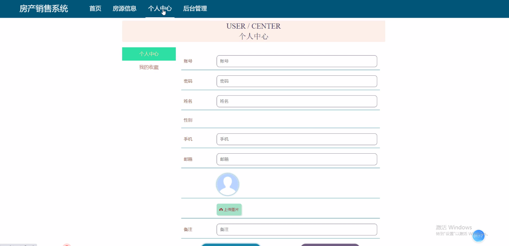

图5-16个人中心界面图

